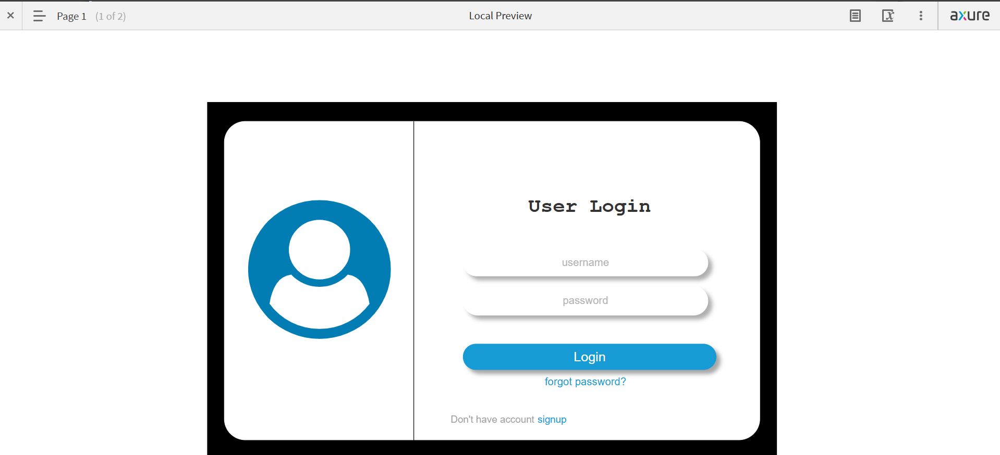
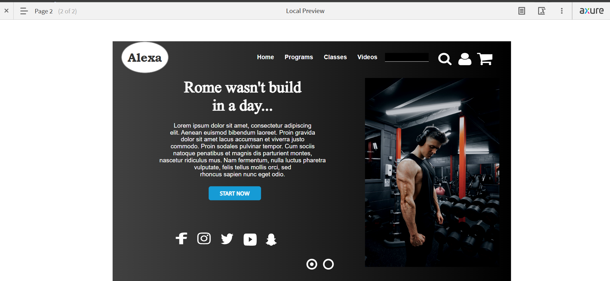

# Day01

## Description
This prototype was created using Axure RP. It includes two pages:
- **First Page**: Contains a login button.
- **Second Page**: The destination page after clicking the login button.

## Features
- Clicking the **Login** button on the first page redirects the user to the second page.

## How to Use
1. Open the Axure RP project file (`.rp`).
2. Click on the **Preview** button to launch the prototype.
3. Click the **Login** button on the first page to navigate to the second page.

## Output

